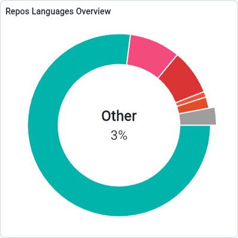

## About Me

**Hey this is MohammadReza** 🙋🏻‍♂️

I'm a seasoned software engineer with a profound expertise in Android and Flutter development. With over **7** years of tech industry experience, including **4** years dedicated to **Flutter**, I possess a strong track record of designing, implementing, and maintaining production-ready mobile applications based on cutting-edge technologies such as Java/Kotlin for Android and Dart for Flutter. My journey includes leadership roles where I've successfully led teams. as a creative, hardworking team player who enjoys sharing my experience and helping to solve challenges from different perspectives, such as business, management, and software, I can play an essential role in the decision-making of cross-functional teams.

<!--

-->

This banner 👇🏻 and the widgets below have been created by the [**GitHub Readme Beautifier**](https://github.com/m-r-davari/github_readme_beautifier) project which I'm currently developing.

<picture>
  <source media="(prefers-color-scheme: dark)" srcset="./assets/mrd_github_meme_dark.gif">
  
</picture>

Its a web app to beautify and enhance your Github README file, that provides interesting widgets in GIF(animated) formats.

<picture>
  <source media="(prefers-color-scheme: dark)" srcset="./assets/typewriter_text_dark.gif">
  
</picture>

<picture>
  <source media="(prefers-color-scheme: dark)" srcset="./assets/most_used_language_dark.gif">
  
</picture>

\.

<picture>
  <source media="(prefers-color-scheme: dark)" srcset="./assets/repos_languages_overview_dark.gif">
  
</picture>

\
Show some ❤️️ and support me with Github star ⭐️ .
([**How To Use**](https://github.com/m-r-davari/github_readme_beautifier))  <!-- ([**Web App Link**](https://m-r-davari.github.io/github_readme_beautifier)) -->
\
You are welcomed to contribute.

## Notes
This project has been developed using Flutter web and is still under development.

<!--

-->

<!--

-->

<!--
<picture>
  <source media="(prefers-color-scheme: dark)" srcset="https://raw.githubusercontent.com/stefanjudis/github-light-dark-image-example/main/dark.png">
  
</picture>
-->

<!--
<picture>
  <source media="(prefers-color-scheme: dark)" srcset="./dark.png">
  
</picture>
-->

<!--comment-->
